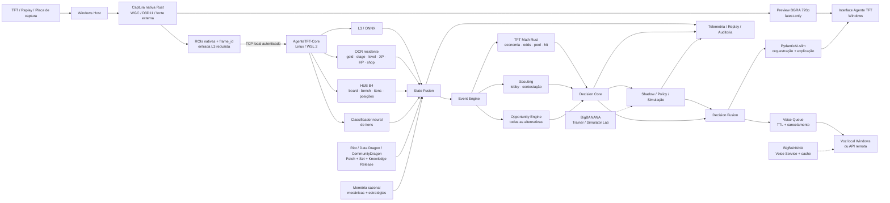

<p align="center">
  
</p>

# Agente TFT


**Agente de inteligência artificial para Teamfight Tactics com captura em tempo real, percepção visual, matemática estratégica, simulação e assistência por voz.**

> **Captura → percepção → estado → matemática → oportunidades → decisão → explicação/voz.**

O **Agente TFT** é um software de engenharia e IA criado para observar uma partida de TFT, reconstruir o estado relevante do jogo e transformar esse estado em recomendações estratégicas curtas, rastreáveis e sustentadas por cálculo.

O projeto combina **captura de vídeo**, **OCR**, **visão computacional**, **modelos ONNX**, **memória temporal**, **matemática determinística em Rust**, **scouting**, **Opportunity Engine**, **Decision Core**, **simulação de combate/laboratório**, **conhecimento sazonal por patch**, serviços remotos de apoio e uma camada de IA responsável por organizar e explicar decisões.

Ele não foi concebido como um chatbot genérico de TFT. A proposta é construir um **motor de decisão que consegue conversar**: primeiro observa e calcula; depois explica.

---

## Arquitetura atual

A arquitetura atual separa três planos:

1. **Windows Host** — captura, preview, interface e supervisão;
2. **AgenteTFT-Core em Linux/WSL 2** — percepção e processamento pesado local;
3. **BigBANANA** — serviços remotos opcionais para voz, laboratório, treino e avaliação.

A fonte pode ser uma partida/replay exibida no Windows ou uma **placa de captura**. O vídeo permanece no host; apenas ROIs, entradas reduzidas e dados necessários à análise seguem para o núcleo Linux.

### Infográfico atualizado



### Separação física

```text
WINDOWS HOST
├── captura Rust
├── placa/fonte de vídeo
├── preview fluida
├── interface
├── voz local
└── supervisor
          │
          │ TCP local autenticado
          ▼
LINUX CORE / WSL 2
├── L3 / ONNX
├── OCR residente
├── HP
├── HUB B4
├── neural item classifier
├── State Fusion
├── Opportunity Runtime
└── Decision Core

BIGBANANA (opcional)
├── Simulator Lab
├── training/evaluation
├── Shadow / counterfactual jobs
├── painel TFT
└── Voice Service HTTPS
```

A falha de um serviço remoto não deve bloquear captura, estado local ou fallback determinístico.

---

## O que já existe no projeto

| Área | Estado atual |
|---|---|
| **Captura Windows** | capturador Rust, WGC/D3D11, fonte por monitor/janela e caminho preparado para captura externa |
| **Preview** | BGRA nativo, `StretchDIBits`, fila latest-only e telemetria de FPS/idade/render |
| **Core Linux** | `AgenteTFT-Core` headless em WSL 2 com protocolo TCP local autenticado |
| **HUD/OCR** | gold, stage, level, XP, HP, shop e controles com leitores residentes e confiança |
| **L3 / ONNX** | mapeamento visual leve de regiões para percepção |
| **Board HUB B4** | board, bench, inventário, candidatos de posição e itens |
| **Itens** | catálogo versionado e classificador neural ONNX integrado ao HUB em modo controlado |
| **State Fusion** | observações com `frame_id`, timestamp, provenance, confidence e validade |
| **TFT Math** | economia, juros, odds, pool, hit probability e budgets de roll |
| **Decision Core** | alternativas, evidence, confidence e fallback determinístico |
| **Opportunity Engine** | ranking explícito de oportunidades e shortlist para avaliação profunda |
| **Scouting** | memória temporal de adversários e contestação |
| **Replay Lab** | ingestão, fixtures, sessões, auditoria, viewers e regressões |
| **Simulator Lab** | simulação sazonal, hex grid, eventos, combate parcial e rollouts de laboratório |
| **Knowledge System** | releases por patch/set, catálogo de unidades/itens/traits e provenance |
| **Strategy Memory** | memória estruturada de mecânicas e linhas estratégicas por patch |
| **Voz** | fila automática, cancelamento por TTL, voz local e serviço remoto opcional |
| **BigBANANA** | trainer isolado, painel web/terminal, jobs e serviços auxiliares |
| **Instalador HM4.5** | instalador Windows com pacote do app, core WSL, hashes e health checks |
| **Licença** | MIT |

---

## Captura, preview e HM4.5

A família HM evoluiu de mapper/replay para um runtime híbrido Windows + Linux.

### Caminho da imagem

```text
FRAME NATIVO
   ├── preview BGRA → UI Windows
   ├── ROI gold
   ├── ROI stage
   ├── ROI level / XP
   ├── ROI HP
   ├── ROI shop
   ├── entrada L3 320×192
   └── board / bench quando necessário
```

A preview e os consumidores analíticos têm cadências independentes. Quando um consumidor fica lento, o sistema substitui trabalho antigo em vez de acumular uma fila infinita.

O runtime também registra:

- FPS recebido e exibido;
- idade do frame;
- tempo de render;
- frames substituídos;
- latência de OCR;
- latência do HUB;
- memória;
- decisões e voz.

---

## AgenteTFT-Core — Linux/WSL 2

O núcleo Linux é um serviço headless versionado e separado da interface.

Ele reúne:

- runtime Python mínimo;
- componentes Rust;
- ONNX Runtime;
- Tesseract residente;
- L3;
- leitores HUD;
- HP;
- HUB B4;
- classificador neural de itens;
- catálogos;
- health checks.

### Protocolo Windows ↔ Core

A comunicação usa:

- TCP local;
- token aleatório de sessão;
- versão de protocolo;
- `request_id`;
- `frame_id`;
- timestamps;
- limites de cabeçalho/payload;
- validação de hashes/modelos;
- timeout;
- shutdown limpo.

Isso permite manter captura e UI nativas no Windows enquanto o processamento pesado fica isolado.

---

## Percepção visual

A regra central permanece:

> **evidência visual não vira verdade de jogo sem confiança e contexto.**

```text
pixels
  ↓
ROI / detector
  ↓
OCR / template / ONNX / probe
  ↓
confidence + provenance + timestamp
  ↓
consenso temporal
  ↓
State Fusion
  ↓
GameState
```

O projeto contém caminhos para:

- OCR Tesseract;
- multi-pass OCR;
- leitores residentes;
- matcher visual;
- L3 ONNX;
- UI-Map;
- board/bench probes;
- HUB B4;
- classificador neural de itens;
- revisão offline e datasets selados.

---

## Catálogo, patch e conhecimento sazonal

O agente mantém conhecimento versionado para impedir mistura silenciosa entre sets/patches.

O pipeline inclui:

```text
Riot / Data Dragon / fontes revisadas
              ↓
        normalização
              ↓
       Knowledge Release
              ↓
 patch + set + hashes + provenance
              ↓
       runtime / simulator
```

O trabalho atual do Set 18 inclui catálogos estruturados de:

- campeões;
- atributos;
- itens;
- traits;
- mecânicas;
- aprimoramentos;
- revisões de patch;
- memória estratégica.

A **Strategy Memory** registra hipóteses e estratégias condicionais sem transformar opinião de guia em regra matemática automática.

---

## Motor matemático

O LLM não calcula probabilidades de jogo.

```text
ECONOMIA
├── juros
├── breakpoints
├── XP / level
└── custo de gastar agora

SHOP / POOL
├── odds
├── unidades observadas
├── contestação
└── hit probability

ROLL
├── budget
├── janelas 10 / 20 / 30g
├── expectativa
└── juros sacrificados

DECISÃO
├── alternatives
├── utility
├── evidence
├── confidence
└── TTL
```

---

## Opportunity Engine

Antes da resposta, o agente pode avaliar o conjunto de oportunidades vigentes.

```text
GameState
   ↓
specialized facts
   ├── economy
   ├── shop / pool
   ├── board
   ├── items
   ├── positioning
   ├── scouting
   └── meta prior
   ↓
Opportunity Engine
   ↓
ALL
   ↓
utility ranking
   ↓
SHORTLIST
   ├── Decision Core
   ├── Shadow
   └── Counterfactual simulation
```

`all` permanece auditável; o shortlist é usado para cálculo profundo.

**Utility é score interno de ranking, não probabilidade.**

---

## Simulator Lab

O projeto agora possui um laboratório próprio para avançar da heurística para avaliação estratégica reproduzível.

O laboratório inclui:

- estado sazonal;
- hex grid;
- combate por eventos;
- mana;
- modificadores;
- traits;
- itens;
- habilidades implementadas de forma incremental;
- seeds reproduzíveis;
- rollouts;
- busca;
- comparação emparelhada de políticas.

### Neural Combat

Há um caminho experimental de **Neural Combat** treinado sobre o simulador parcial.

Os candidatos são avaliados separadamente do coach Windows e carregam:

- schema do modelo;
- cobertura efetiva;
- treino;
- validação;
- comparação emparelhada;
- avaliação de planejamento;
- revisão de ações.

Um candidato de laboratório **não é promovido automaticamente** ao runtime só porque apresentou boa métrica em dados simulados.

---

## BigBANANA — Agente 2 / plano remoto

O BigBANANA funciona como infraestrutura de treinamento e avaliação, não como controlador do cliente TFT.

### Trainer

O serviço remoto suporta a arquitetura para:

- sessões;
- jobs;
- Shadow Player;
- Counterfactual Swarm;
- métricas;
- armazenamento SQLite/WAL;
- painel web;
- terminal `tft`;
- CPU/RAM;
- histórico de execuções.

```text
GameState
   ├── Shadow Player → mantém uma linha sequencial
   └── Counterfactual Swarm → compara futuros alternativos
```

O objetivo é comparar:

```text
ação recomendada
× ação humana
× Shadow
× melhor branch
× outcome
```

---

## Voz e Companion Service

O agente possui dois caminhos de voz:

### Local

- síntese em processo separado;
- fila de uma fala;
- cancelamento se a decisão expirar;
- associação com `frame_id`;
- cache local limitado.

### Remoto

Um **Companion Service** independente no BigBANANA fornece voz por HTTPS.

O serviço inclui:

- sessão anônima;
- autenticação por token;
- limites de uso;
- cache persistente de áudio;
- gateway dedicado;
- rate limiting;
- isolamento dos demais serviços;
- endpoint de resumo de jogador preparado para adaptador externo.

O serviço remoto recebe texto a narrar; **não recebe frames da captura**.

---

## Recomendação e voz

Uma recomendação pode conter:

```text
action
target
reason
basis
confidence
frame_id
source_age_ms
expires_at
suppression_reason
```

Fluxo:

```text
Decision Core
    ↓
recomendação atual?
    ├── não → suprimir/cancelar
    └── sim
         ↓
       UI
         ↓
    Voice Queue
         ↓
 local synth ou API remota
```

Isso impede que uma fala antiga continue depois que o estado da partida mudou.

---

## Scouting e memória temporal

O sistema possui estruturas para:

- adversários observados;
- contestação por player/unidade;
- `OpponentObserved`;
- `ContestationChanged`;
- histórico de lobby;
- idade da observação;
- uso de contestação na análise estratégica.

Snapshot antigo não é tratado como estado atual.

---

## Replay e auditoria

O projeto mantém uma linha de validação baseada em replay:

- Replay Intake;
- E1 Replay Lab;
- HM sessions;
- fixtures;
- golden tests;
- comparações A/B;
- viewers;
- telemetry JSONL;
- evidências por hash;
- regressões permanentes.

```text
vídeo / captura
→ frames
→ percepção
→ estado
→ decisão
→ voz
→ telemetria
→ auditoria
```

---

## Instalador HM4.5

O fluxo HM4.5 prepara um único instalador Windows com:

```text
AgenteTFT-HM45-Setup.exe
├── app Windows
├── captura Rust
├── preview
├── supervisor
├── modelos / catálogos
├── vozes locais
└── AgenteTFT-Core WSL
```

O instalador verifica:

- Windows x64;
- virtualização;
- WSL 2;
- espaço;
- SHA-256;
- versão do core;
- conectividade local;
- L3;
- OCR;
- HP;
- HUB B4;
- health contract.

Também existe um caminho de **instalador online**: o bootstrap pequeno baixa uma versão fixa do pacote, valida o SHA-256 e só então inicia a instalação.

---

## Stack

| Camada | Tecnologia |
|---|---|
| Captura Windows | Rust + WGC/D3D11 |
| Fonte externa | placa/fonte de captura |
| Preview | BGRA + GDI/`StretchDIBits` |
| Core local | Linux headless / WSL 2 |
| Transporte | TCP local autenticado |
| Caminho crítico | Rust |
| OCR | Tesseract residente |
| Visão | ONNX Runtime |
| Neural items | ONNX |
| Treino | Python + PyTorch |
| Simulação | Python/Rust + laboratório determinístico |
| Estado | Rust/Pydantic schemas |
| Matemática | Rust |
| Orquestração | PydanticAI-slim |
| Conhecimento | Riot / Data Dragon / CommunityDragon |
| Remote trainer | Docker + SQLite/WAL |
| Voz remota | HTTPS + cache persistente |
| Telemetria | JSONL + evidências versionadas |
| UI | Windows; Tauri/Svelte como direção de produto |

---

## Estrutura do repositório

```text
Agente-TFT/
├── agent/
├── apps/
│   ├── e1_replay/
│   └── hud_mapper/
├── assets/
├── configs/
│   ├── catalog/
│   ├── contexts/
│   ├── services/
│   ├── simulation/
│   └── training/
├── docs/
│   └── evidence/
├── experiments/
├── ingestion/
├── knowledge/
├── models/
├── rust/
├── scripts/
├── telemetry/
├── tools/
├── trainer/
├── training/
└── tests/
```

---

## Princípios

- **Estado antes de estratégia.**
- **Cálculo antes de linguagem.**
- **Captura separada da análise.**
- **Preview separada do OCR.**
- **Core local separado da UI.**
- **Eventos antes de polling pesado.**
- **Confiança e TTL explícitos.**
- **Patch-aware por padrão.**
- **Backpressure em vez de filas infinitas.**
- **Replay antes de promoção.**
- **Modelo experimental não é automaticamente produção.**
- **LLM nunca é fonte de verdade matemática.**
- **Serviço remoto não controla o cliente TFT.**

---

## Limites operacionais

O Agente TFT não depende de:

- injeção no processo do jogo;
- leitura de memória do cliente;
- bypass de anti-cheat;
- automação invisível de mouse/teclado;
- confiança fabricada pelo LLM.

O foco é **percepção, cálculo, simulação, recomendação, voz, replay e pesquisa reproduzível**.

---

## Documentação

- [Arquitetura](docs/ARCHITECTURE.md)
- [Engenharia](docs/ENGINEERING.md)
- [Escopo](docs/PROJECT_SCOPE.md)
- [Roadmap](docs/ROADMAP.md)
- [ADRs](docs/adr/)
- [Contribuidores](CONTRIBUTORS.md)

A árvore de desenvolvimento contém ainda documentação específica de HM4/HM4.5, Simulator Lab, percepção/catalogação, Strategy Memory, voz e evidências de treino/validação.

---

## Licença

Este projeto é distribuído sob a **MIT License**. Consulte [LICENSE](LICENSE) para os termos completos.

---

## Contribuidores

- [Glaudson Vilela (@glaudsonvilela)](https://github.com/glaudsonvilela)
- [Maii-Oliv (@Maii-Oliv)](https://github.com/Maii-Oliv)

---

**Agente TFT está em desenvolvimento ativo.** O objetivo é construir um agente estratégico de alta complexidade com **captura robusta, estado confiável, matemática verificável, simulação reproduzível, isolamento de processamento, baixa latência, auditabilidade e decisões explicáveis**.
