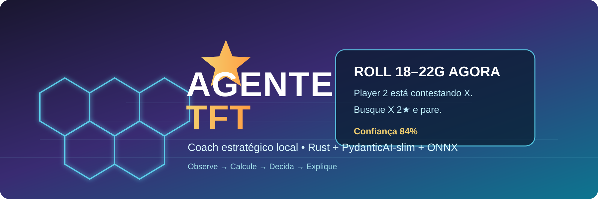

<p align="center">
  
</p>

# Agente TFT

**Coach estratégico local para Teamfight Tactics.**

> **Observe o jogo. Calcule as alternativas. Diga o que fazer — direto.**

O **Agente TFT** é um projeto de engenharia para construir um copiloto estratégico que reconstrói o estado da partida, acompanha o lobby, combina visão computacional, dados oficiais, conhecimento atualizado por patch e um modelo de decisão treinado para produzir recomendações curtas e acionáveis.

### Exemplo de saída

```text
ROLE 18–22G AGORA

Player 2 começou a contestar sua carry.
Busque X 2★ e pare.

Confiança: 84%
```

## Objetivo

O agente deve observar continuamente o estado disponível da partida e responder perguntas práticas como:

- comprar ou não uma unidade;
- rolar agora, quanto rolar e quando parar;
- subir de nível agora ou preservar economia;
- abandonar uma linha muito contestada;
- escolher uma transição;
- avaliar itens, augments e posicionamento;
- considerar o que foi observado nos outros jogadores;
- explicar a recomendação em **uma frase curta**.

O cérebro pode ser complexo. A interface não pode ser.

## Princípio central

```text
PERCEPÇÃO → ESTADO → CÁLCULO → POLICY → ORQUESTRAÇÃO → RECOMENDAÇÃO
```

O LLM **não inventa matemática**. Probabilidades, economia, disponibilidade de unidades, scores e decisões quantitativas devem vir de código determinístico e/ou do policy model.

## Stack planejada

| Camada | Tecnologia |
|---|---|
| Captura, estado, eventos e matemática | Rust |
| Visão em produção | ONNX Runtime / Rust |
| Treino de visão e policy | Python + PyTorch |
| Orquestração | PydanticAI-slim |
| Dados do jogo | Riot APIs + Data Dragon + CommunityDragon |
| Conhecimento externo | pipeline de ingestão + normalização por patch |
| Persistência local | SQLite + arquivos versionados |
| UI lateral | Tauri + Svelte |
| Telemetria | eventos estruturados + recorder |

## Arquitetura resumida

```text
                         TFT
                          │
              ┌───────────┴───────────┐
              │                       │
       captura/visão              dados externos
          Rust/ONNX          Riot + Knowledge Pack
              │                       │
              └───────────┬───────────┘
                          ▼
                    STATE FUSION
                          │
                    Event Engine
                          │
          ┌───────────────┼───────────────┐
          ▼               ▼               ▼
      TFT Math        Policy Model     Knowledge
        Rust             ONNX          local/cache
          └───────────────┼───────────────┘
                          ▼
                   PydanticAI-slim
                          │
                          ▼
                  Decision Fusion
                          │
                          ▼
                    Tauri/Svelte
```

## Estrutura do repositório

```text
Agente-TFT/
├── agent/        # PydanticAI-slim, tools, schemas e prompts
├── assets/       # banner, screenshots e diagramas
├── docs/         # arquitetura, engenharia, ADRs e roadmap
├── ingestion/    # Riot/CommunityDragon/web → Knowledge Pack
├── knowledge/    # schemas e dados normalizados por patch
├── models/       # artefatos de visão e policy
├── rust/         # caminho crítico de baixa latência
├── training/     # simulador, self-play, datasets e avaliação
├── ui/           # aplicação desktop Tauri/Svelte
├── telemetry/    # recorder, métricas e auditoria
├── scripts/      # automação de build/dev/sync
└── tests/        # integração e testes end-to-end
```

## Filosofia de decisão

Cada recomendação deve ter uma estrutura estável:

```text
AÇÃO
MOTIVO EM UMA FRASE
CONDIÇÃO DE PARADA / PRÓXIMO PASSO
CONFIANÇA
```

A interface detalhada fica disponível sob demanda, mas o modo de partida permanece direto.

## Estado do projeto

**Fase 0 — Fundação e engenharia.**

O repositório começa com a arquitetura, contratos, organização e roadmap antes da implementação. O primeiro objetivo técnico é reconstruir o estado do TFT com alta confiabilidade e latência baixa; só depois entra o policy model.

Veja:

- [Arquitetura](docs/ARCHITECTURE.md)
- [Engenharia](docs/ENGINEERING.md)
- [Escopo](docs/PROJECT_SCOPE.md)
- [Roadmap](docs/ROADMAP.md)
- [ADRs](docs/adr/)

## Nota sobre uso

O projeto deve separar claramente **laboratório/replay/simulação** de qualquer modo utilizado durante partidas oficiais. Integrações e funcionalidades em tempo real precisam ser revisadas contra as políticas atuais da Riot antes de serem habilitadas em produção.

---

**Projeto em desenvolvimento.** A prioridade é precisão, auditabilidade e baixa latência — não quantidade de features.
