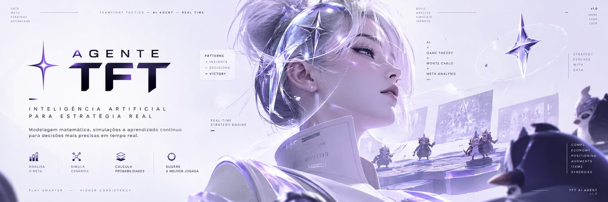
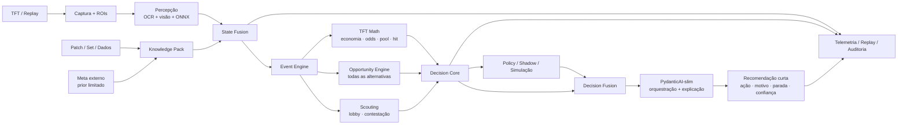

<p align="center">
  
</p>

# Agente TFT

**Agente de inteligência artificial para análise estratégica de Teamfight Tactics em tempo real, replay e laboratório.**

> **Estado confiável → cálculo → alternativas → decisão → explicação curta.**

O **Agente TFT** é um software de engenharia e IA criado para transformar o estado de uma partida de TFT em decisões estratégicas auditáveis. Ele combina **captura e visão computacional**, **OCR**, **memória temporal do lobby**, **matemática determinística em Rust**, **simulação de cenários**, **modelos ONNX**, dados versionados por patch e uma camada de IA responsável por organizar e explicar a decisão.

O projeto não foi concebido como um chatbot genérico sobre TFT. A proposta é construir um **motor de decisão que consegue conversar**: primeiro o software observa e calcula; depois explica o que encontrou.

---

## Finalidade

O agente foi projetado para ajudar a responder, com contexto e confiança explícita, perguntas como:

- **Comprar ou ignorar** uma unidade;
- **Rolar agora**, definir orçamento e condição de parada;
- **Subir de nível** ou preservar economia;
- avaliar **probabilidade de hit** e custo esperado;
- perceber quando uma linha ficou **contestada**;
- sugerir **pivot** ou transição parcial;
- comparar alternativas de **board, bench, itens, augments e posicionamento**;
- acompanhar adversários e mudanças no lobby;
- usar contexto de meta apenas como **prior limitado**, nunca acima do estado real da partida;
- explicar a recomendação em poucas linhas.

### Formato de saída

```text
ROLE 18–22G AGORA

Player 2 começou a contestar sua carry.
Busque X 2★ e pare.

Confiança: 84%
```

A interface pode ser simples porque a complexidade permanece no motor.

---

## Infográfico — como o Agente TFT pensa



### Princípio do caminho crítico

```text
frame
  ↓
percepção
  ↓
estado
  ↓
evento
  ↓
cálculo
  ↓
oportunidades
  ↓
decisão
  ↓
explicação
```

O **LLM não é a calculadora do sistema**. Probabilidades, economia, disponibilidade de unidades, scores e regras quantitativas pertencem ao código determinístico e aos modelos próprios.

---

## O que já existe no software

| Área | Estado | Implementação atual |
|---|---:|---|
| **Fundação e contratos** | ✅ | `GameState`, `GameEvent`, `DecisionPacket` e `Recommendation` versionados em Rust/Pydantic, confiança validada e telemetria estruturada |
| **Captura e replay** | 🟡 | `CaptureSource`, `FrameEnvelope`, fixtures, replay via FFmpeg, ROIs normalizadas, detector de mudança, ROI router e replay inspector |
| **HUD / OCR** | 🟡 | grayscale, contraste, threshold, upscale, Tesseract, leitura de stage/gold/HP/level/XP, multi-pass, gates de domínio e consenso temporal |
| **Shop** | 🟡 | percepção por slots, matcher visual, snapshot completo, consenso temporal e experimentos com campos numéricos isolados por aparência |
| **Board / Bench** | 🟡 | geometria, probes espaciais, evidência visual de presença, hipóteses locais e viewers de inspeção sem promover inferência incerta ao estado |
| **Scouting** | 🟡 | memória estabilizada de adversários, contestação por player/unidade e eventos `OpponentObserved` / `ContestationChanged` |
| **TFT Math** | 🟡 | economia/interest, odds configuráveis, pool snapshot, probabilidade de hit, budgets de roll e janelas estratégicas de 10/20/30g |
| **Opportunity Engine** | 🟡 | arquitetura para avaliar todas as oportunidades, manter `all` para auditoria e produzir shortlist por utility explícita |
| **Decision Core** | 🟡 | filtros de confiança, alternativas, evidence e fallback determinístico sem depender de LLM |
| **PydanticAI-slim** | 🟡 | agente tipado, tools somente leitura/contexto, explicação estruturada e ação/confiança preservadas |
| **Visão treinável** | 🧪 | UI-Map Lite U1 com caminho ONNX isolado para localização grosseira de regiões de shop/bench; ainda sem alegação de precisão semântica de TFT |
| **Detectores pré-treinados** | 🧪 | comparação isolada com detector visual pré-treinado, sem substituir automaticamente os baselines congelados |
| **Policy Model / self-play** | ⏳ | ambiente de treino, imitation learning, PPO/self-play e export ONNX fazem parte do próximo estágio |
| **UI lateral** | ⏳ | Tauri/Svelte planejado para ação dominante, motivo, condição de parada, confiança e painel detalhado opcional |

**Legenda:** ✅ base consolidada · 🟡 implementado parcialmente / em validação · 🧪 experimental isolado · ⏳ próximo estágio.

---

## Visão computacional: abordagem atual

A percepção é construída em camadas para evitar que um detector impreciso contamine o estado da partida:

```text
pixels
  ↓
região conhecida
  ↓
evidência visual / OCR / detector
  ↓
confidence + provenance + timestamp
  ↓
consenso temporal
  ↓
GameState somente quando o gate permite
```

O repositório já contém caminhos de comparação entre:

- baselines visuais congelados;
- OCR Tesseract;
- probes de board/bench;
- hipóteses locais de superfície/presença;
- detector pré-treinado em ambiente isolado;
- **UI-Map Lite U1**, um núcleo treinável leve exportado para ONNX.

Esses experimentos permanecem separados do estado oficial até que exista evidência suficiente de precisão, latência e estabilidade.

---

## Motor matemático

A parte quantitativa fica fora do LLM e é tratada como infraestrutura de baixa latência.

Hoje o projeto já possui cálculos para:

```text
ECONOMIA
├── juros
├── breakpoints
└── custo de gastar agora

SHOP / POOL
├── odds por nível
├── pool observada
├── contestação
└── probabilidade de hit

ROLL
├── orçamento
├── janelas 10 / 20 / 30g
├── expectativa
└── juros sacrificados

DECISÃO
├── alternativas
├── utility
├── evidence
└── confidence
```

A evolução prevista adiciona força de board, features de ação, traits, itens, augments e um policy model calibrado.

---

## Opportunity Engine

Toda recomendação deve passar por um estágio que **calcula as oportunidades vigentes antes de responder**.

```text
GameState
   ↓
fatos especializados
   ├── economia
   ├── shop / pool
   ├── board / bench
   ├── scouting
   ├── itens / augments
   └── meta prior
   ↓
Opportunity Engine
   ↓
ALL opportunities ───────→ auditoria / replay
   ↓
utility ranking
   ↓
shortlist
   ├── Decision Core
   ├── Shadow Player
   └── Counterfactual simulation
```

A utility pode combinar, de forma explícita e versionada:

- ganho imediato de board;
- valor de upgrade;
- preservação de HP;
- valor de economia;
- urgência por contestação;
- flexibilidade;
- valor de informação;
- prior externo;
- penalidade de incerteza.

**Utility é ranking interno, não probabilidade.**

---

## Meta e dados externos

Fontes externas podem enriquecer a análise, mas não comandam a decisão.

```text
fonte externa
   ↓
normalização + provenance
   ↓
patch / set / freshness gate
   ↓
MetaSnapshot local
   ↓
prior limitado
   ↓
Opportunity Engine
```

Regras:

- nenhuma consulta externa no hot path;
- provenance obrigatório;
- snapshot de patch/set incompatível é rejeitado;
- dados stale não são silenciosamente reutilizados;
- influência externa é limitada;
- **GameState e matemática local têm prioridade**.

---

## Arquitetura

| Camada | Tecnologia / direção |
|---|---|
| Caminho crítico | **Rust** |
| Captura / replay | Rust + FFmpeg |
| OCR | Tesseract + pré-processamento próprio |
| Visão em produção | ONNX Runtime / Rust |
| Treino e experimentos | Python + PyTorch |
| Estado e eventos | schemas versionados Rust/Pydantic |
| Matemática | Rust |
| Orquestração | PydanticAI-slim |
| Dados estáticos | Riot / Data Dragon / CommunityDragon + Knowledge Pack |
| Telemetria | JSONL + evidências versionadas |
| Persistência alvo | SQLite + arquivos/hash |
| UI alvo | Tauri + Svelte |

### Perfis de execução

- **lab** — datasets, simuladores e experimentos;
- **replay** — vídeos, gravações e validação determinística;
- **live-approved** — somente capacidades revisadas para uso ao vivo.

O desenvolvimento principal acontece no **Ubuntu**. O runtime live alvo é **single-host no Windows**, com TFT e Agente TFT no mesmo PC.

---

## Engenharia e auditabilidade

Cada recomendação deve poder ser reconstruída:

```text
GameState
→ observations
→ features
→ math outputs
→ opportunities
→ candidate actions
→ policy / simulation
→ recommendation
→ ação observada
→ próximo estado
→ outcome
```

O sistema também foi desenhado para:

- não criar filas infinitas de frames;
- descartar trabalho visual que ficou obsoleto;
- recalcular por evento, não por polling pesado;
- manter modo degradado quando uma fonte falha;
- separar evidência, hipótese e estado confirmado;
- registrar hashes, versões e provenance;
- medir CPU, RAM, latência e taxa de campos desconhecidos.

---

## Estrutura do repositório

```text
Agente-TFT/
├── agent/        # PydanticAI-slim, tools, schemas e prompts
├── assets/       # banner, screenshots e diagramas
├── configs/      # layouts, UI profiles e políticas versionadas
├── docs/         # arquitetura, engenharia, ADRs e roadmap
├── ingestion/    # Riot/CommunityDragon/web → Knowledge Pack
├── knowledge/    # schemas e dados normalizados por patch
├── models/       # artefatos de visão e policy
├── rust/         # caminho crítico de baixa latência
├── training/     # datasets, simulação, treino e avaliação
├── ui/           # aplicação desktop
├── telemetry/    # recorder, métricas e evidências
├── scripts/      # build, probes, benchmark e automação
└── tests/        # integração, replay e regressão
```

---

## O que ainda falta

Os principais gates em aberto são:

1. ampliar datasets reais rotulados;
2. fechar calibração de HUD, shop, board e bench em gravações reais;
3. medir precisão/recall, unknown rate e latência end-to-end;
4. completar itens, augments e traits;
5. consolidar board-strength e action features;
6. treinar e comparar policy models contra baselines;
7. finalizar UI lateral;
8. executar Shadow Lab com comparação agente × ação humana × outcome;
9. validar qualquer perfil ao vivo contra as políticas aplicáveis antes de habilitá-lo.

Nenhuma etapa é considerada concluída apenas porque existe código. O gate exige **dados reais, métricas, testes reproduzíveis, telemetria e comportamento degradado explícito**.

---

## Limites do projeto

O Agente TFT **não tem como objetivo inicial**:

- automatizar mouse ou teclado;
- injetar código no processo do jogo;
- ler memória do cliente;
- contornar Vanguard ou mecanismos anti-cheat;
- fabricar confiança quando a percepção é incerta;
- deixar o LLM substituir matemática ou estado observável.

O foco é **análise, simulação, recomendação e pesquisa reproduzível**.

---

## Documentação

- [Arquitetura](docs/ARCHITECTURE.md)
- [Engenharia](docs/ENGINEERING.md)
- [Escopo](docs/PROJECT_SCOPE.md)
- [Roadmap](docs/ROADMAP.md)
- [ADRs](docs/adr/)
- [Contribuidores](CONTRIBUTORS.md)

---

## Contribuidores

- [Glaudson Vilela (@glaudsonvilela)](https://github.com/glaudsonvilela)
- [Maii-Oliv (@Maii-Oliv)](https://github.com/Maii-Oliv)

---

**Agente TFT está em desenvolvimento ativo.** A prioridade é construir um sistema estratégico de alta complexidade com **estado confiável, matemática verificável, baixa latência, auditabilidade e decisões explicáveis**.
