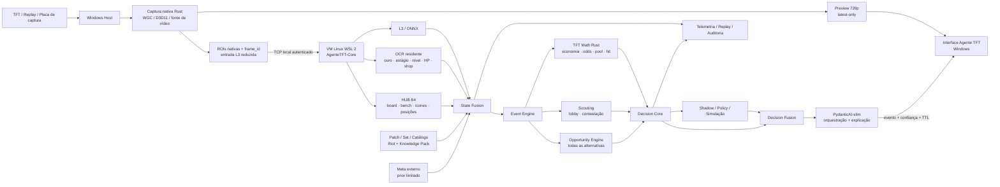

<p align="center">
  
</p>

# Agente TFT


**Agente de inteligência artificial para análise estratégica de Teamfight Tactics em tempo real, replay e laboratório.**

> **Captura confiável → percepção → estado → matemática → oportunidades → decisão → explicação.**

O **Agente TFT** é um software de engenharia e IA criado para observar uma partida de Teamfight Tactics, reconstruir o estado relevante do jogo e transformar esse estado em recomendações estratégicas curtas, rastreáveis e sustentadas por cálculo.

O projeto combina **captura de vídeo**, **visão computacional**, **OCR**, **modelos ONNX**, **memória temporal**, **matemática determinística em Rust**, **scouting**, **Opportunity Engine**, **Decision Core** e uma camada de IA responsável por orquestrar e explicar a decisão.

Ele não foi concebido como um chatbot genérico de TFT. A proposta é construir um **motor de decisão que consegue conversar**: primeiro observa e calcula; depois explica.

---

## Arquitetura atual — Windows + núcleo Linux isolado

A arquitetura evoluiu para separar a experiência visual do processamento pesado.

O **Windows** continua responsável pela captura e pela interface. O núcleo de análise roda em uma **VM Linux leve via WSL 2**, sem desktop, conectada ao host por um protocolo local autenticado.

A fonte de vídeo pode vir da partida/replay no host e, no perfil de captura externo, de uma **placa de captura**. O frame entra no capturador nativo do Windows; a prévia segue diretamente para a UI e apenas os dados necessários à análise atravessam para o núcleo Linux.

### Infográfico atualizado



### Separação de responsabilidades

```text
WINDOWS HOST
├── captura nativa
├── placa/fonte de vídeo
├── preview fluida
├── interface
└── supervisor da sessão
          │
          │ TCP local autenticado
          ▼
LINUX CORE / WSL 2
├── L3 / ONNX
├── OCR residente
├── HP
├── HUB B4
├── State Fusion
├── Opportunity Runtime
├── Decision Core
└── emissão de recomendações
```

A VM não precisa capturar a tela do Windows nem renderizar a interface. Isso mantém o caminho visual separado do caminho analítico e evita enviar vídeo de preview desnecessariamente para o núcleo Linux.

---

## Finalidade

O agente foi projetado para responder perguntas práticas como:

- **Comprar ou ignorar** uma unidade;
- **Rolar agora**, quanto rolar e quando parar;
- **Subir de nível** ou preservar economia;
- calcular **probabilidade de hit**;
- comparar gasto imediato com juros e economia futura;
- detectar **contestação** no lobby;
- sugerir **pivot** ou transição parcial;
- avaliar board, bench, shop, itens e posicionamento;
- acompanhar adversários;
- comparar alternativas antes de recomendar uma ação;
- explicar a recomendação em poucas linhas.

### Formato de recomendação

```text
ROLE 18–22G AGORA

Player 2 começou a contestar sua carry.
Busque X 2★ e pare.

Confiança: 84%
```

Cada recomendação pode carregar internamente:

```text
action
target
reason
basis
confidence
frame_id
source_age_ms
expires_at
suppression_reason
```

Uma recomendação expirada ou sustentada por dados insuficientes deve ser suprimida em vez de apresentada como certeza.

---

## Captura e pipeline HM4 / HM4.5

O projeto já possui uma linha própria de captura e mapeamento visual construída em etapas.

### HUD Mapper

A família HM implementa:

- sessões reproduzíveis;
- captura e replay;
- relógio de captura;
- mapeamento de regiões;
- HUD automático;
- OCR de campos;
- runtime de sessão;
- cache;
- telemetria;
- auditoria de sessões;
- integração com o HUB de board;
- infraestrutura para execução Windows ↔ Linux.

### Captura nativa

O caminho de captura foi desenhado para manter cada consumidor independente:

```text
FRAME NATIVO
   ├── preview → UI
   ├── ROI ouro
   ├── ROI stage
   ├── ROI level / XP
   ├── ROI HP
   ├── ROI shop
   ├── entrada L3
   └── board / bench quando necessário
```

A prévia não deve ser limitada pela frequência do OCR ou do detector. Consumidores lentos usam **latest-only/backpressure**, descartando trabalho visual já obsoleto.

---

## Núcleo Linux / AgenteTFT-Core

O núcleo Linux é um serviço headless versionado.

Ele inclui:

- worker de análise;
- runtime Python mínimo;
- componentes Rust;
- ONNX Runtime CPU;
- OCR/Tesseract residente;
- modelos;
- catálogo versionado;
- HUB B4;
- protocolo local;
- health check.

A comunicação Windows ↔ Linux usa:

- conexão TCP local;
- token aleatório por sessão;
- versão de protocolo;
- `request_id`;
- `frame_id`;
- timestamps;
- limite explícito de payload;
- validação de modelo/catálogo;
- desligamento limpo.

O host pode detectar queda da VM, exibir o estado ao usuário e reconectar sem misturar resultados de frames diferentes.

---

## Visão computacional

A percepção segue uma regra central: **nenhum detector sozinho define a verdade do jogo**.

```text
pixels
  ↓
ROI / região observada
  ↓
OCR / template / modelo / probe
  ↓
confidence + provenance + timestamp
  ↓
consenso temporal
  ↓
State Fusion
  ↓
GameState
```

O repositório contém e experimenta diferentes caminhos:

- OCR Tesseract;
- multi-pass OCR;
- leitores residentes;
- probes de HUD;
- matcher visual;
- board/bench spatial probes;
- hipóteses de presença;
- detectores pré-treinados isolados;
- UI-Map Lite;
- L3 ONNX;
- HUB B4.

Resultados experimentais permanecem isolados até passarem pelos gates definidos para confiança, estabilidade e latência.

---

## HUB B4 — board, bench e evidência visual

O HUB B4 organiza evidências relacionadas ao tabuleiro e inventário visual.

Ele trabalha com:

- geometria de board;
- geometria de bench;
- candidatos de posição;
- candidatos de item;
- ícones equipados;
- inventário;
- snapshots estruturados;
- referência por set;
- hashes de evidência.

O HUB produz **evidência observada**, não ordens automáticas. Uma presença visual isolada não é suficiente para emitir “equipe”, “compre” ou “mova”.

---

## Estado, eventos e memória temporal

O `GameState` é a representação central do estado conhecido.

```text
GameState
├── match
├── player
│   ├── hp
│   ├── gold
│   ├── level
│   ├── xp
│   ├── board
│   ├── bench
│   ├── shop
│   ├── items
│   └── augments
├── lobby
│   └── opponents[]
├── history
└── confidence
```

O Event Engine evita recalcular tudo continuamente. Mudanças relevantes podem gerar eventos como:

- round changed;
- shop changed;
- board changed;
- bench changed;
- gold changed;
- HP changed;
- level changed;
- opponent observed;
- contestation changed;
- combat started/ended.

---

## Motor matemático

A parte quantitativa fica fora do LLM.

```text
ECONOMIA
├── juros
├── breakpoints
└── custo de gastar agora

SHOP / POOL
├── odds por nível
├── unidades observadas
├── pool estimada
├── contestação
└── probabilidade de hit

ROLL
├── budget
├── 10 / 20 / 30g
├── expectativa
└── juros sacrificados

DECISÃO
├── alternativas
├── utility
├── evidence
└── confidence
```

O LLM não inventa matemática. Ele recebe resultados estruturados do motor e os transforma em comunicação legível.

---

## Opportunity Engine

Antes de responder, o agente pode avaliar **todas as oportunidades válidas do estado atual**.

```text
GameState
   ↓
fatos especializados
   ├── economy
   ├── shop / pool
   ├── board strength
   ├── items
   ├── positioning
   ├── scouting
   └── external meta prior
   ↓
Opportunity Engine
   ↓
ALL opportunities
   ↓
utility ranking
   ↓
shortlist
   ├── Decision Core
   ├── Shadow Player
   └── Counterfactual simulation
```

A lista `all` permanece disponível para auditoria e replay. O shortlist concentra a análise profunda nas alternativas mais relevantes.

**Utility é score de ranking interno, não probabilidade.**

---

## Scouting e contestação

O sistema mantém memória temporal do lobby para identificar mudanças relevantes.

Já existem estruturas para:

- adversários observados;
- unidades observadas;
- contestação por player/unidade;
- `OpponentObserved`;
- `ContestationChanged`;
- contexto de lobby;
- uso de contestação nos cálculos de estratégia.

A observação dos adversários é tratada como evidência temporal, não como snapshot eterno.

---

## Meta e conhecimento por patch

Fontes externas são tratadas como **priors limitados**.

```text
Riot / Data Dragon / CommunityDragon
                ↓
        Knowledge Pack local
                ↓
       patch + set + freshness
                ↓
              State

Meta público
    ↓
normalização + provenance
    ↓
MetaSnapshot local
    ↓
bounded prior
    ↓
Opportunity Engine
```

Regras:

- nenhuma dependência de consulta externa no hot path;
- patch/set incompatível invalida o dado;
- provenance obrigatório;
- snapshot stale é ignorado;
- estado observado e matemática local têm prioridade.

---

## Replay e laboratório

O projeto possui caminhos separados para reprodução e validação:

- Replay Intake;
- E1 Replay Lab;
- fixtures;
- gravações reais;
- auditorias HM4;
- comparação de sessões;
- benchmarks;
- viewers locais;
- testes golden;
- regressões permanentes.

O mesmo pipeline de decisão pode ser exercitado sobre partidas gravadas antes de qualquer uso live.

---

## Instalador HM4.5

A arquitetura HM4.5 inclui um instalador guiado para Windows.

O fluxo previsto e implementado no ramo HM4.5 prepara:

```text
AgenteTFT-Setup.exe
   ├── aplicativo Windows
   ├── capturador
   ├── interface
   ├── supervisor
   ├── rootfs AgenteTFT-Core
   ├── modelos / catálogos
   └── manifesto + hashes
```

O assistente verifica:

- Windows x64;
- virtualização;
- WSL 2;
- espaço disponível;
- integridade SHA-256;
- versão do núcleo;
- conexão Windows ↔ Linux;
- L3;
- OCR;
- HP;
- HUB B4.

O núcleo Linux é instalado como distribuição própria do Agente TFT, sem depender de desktop Linux.

---

## Engenharia e auditabilidade

Cada decisão deve poder ser reconstruída:

```text
fonte de vídeo
→ frame
→ observações
→ confidence / provenance
→ GameState
→ eventos
→ math outputs
→ oportunidades
→ candidate actions
→ policy / simulation
→ recommendation
→ ação observada
→ próximo estado
→ outcome
```

O sistema foi desenhado para:

- usar backpressure;
- descartar frames obsoletos;
- manter alinhamento por `frame_id`;
- separar preview e análise;
- separar evidência de estado confirmado;
- registrar hashes e versões;
- limitar payloads;
- manter timeout;
- sobreviver à indisponibilidade de uma fonte;
- medir CPU, RAM, latência e idade da informação.

---

## Stack

| Camada | Tecnologia |
|---|---|
| Captura Windows | Rust + WGC/D3D11 / fonte de captura |
| Interface host | Windows |
| Núcleo isolado | Linux headless via WSL 2 |
| Transporte host/core | TCP local autenticado |
| Caminho crítico | Rust |
| OCR | Tesseract + leitores residentes |
| Visão | ONNX Runtime + modelos próprios/experimentais |
| Treino | Python + PyTorch |
| Estado | Rust/Pydantic schemas |
| Matemática | Rust |
| Orquestração | PydanticAI-slim |
| Conhecimento | Riot / Data Dragon / CommunityDragon |
| Telemetria | JSONL + evidências versionadas |
| Persistência | SQLite + arquivos/hash |
| UI | Tauri/Svelte como direção de produto |

---

## Estrutura do repositório

```text
Agente-TFT/
├── agent/                  # agente, schemas, tools e prompts
├── apps/
│   ├── e1_replay/          # laboratório de replay
│   └── hud_mapper/         # HM1 → HM4/HM4.5
├── assets/                 # banner e material visual
├── configs/                # layouts, contextos e políticas
├── docs/                   # arquitetura, HM, engenharia e ADRs
├── experiments/            # modelos e comparações isoladas
├── ingestion/              # Riot/Data Dragon/CommunityDragon
├── knowledge/              # conhecimento versionado por patch/set
├── models/                 # artefatos ONNX e policy
├── rust/                   # caminho crítico
├── scripts/                # build, pacote, auditoria e instalação
├── telemetry/              # sessões e evidências
├── tools/                  # ferramentas nativas auxiliares
├── training/               # datasets, treino e avaliação
└── tests/                  # integração e regressão
```

---

## Princípios do projeto

- **Estado antes de estratégia.**
- **Cálculo antes de linguagem.**
- **Captura separada da análise.**
- **Preview separada do OCR.**
- **Eventos antes de polling pesado.**
- **Confiança explícita.**
- **Patch-aware por padrão.**
- **Backpressure em vez de filas infinitas.**
- **Replay/laboratório antes de promoção.**
- **LLM nunca como fonte de verdade matemática.**
- **Falha da VM não pode fabricar uma recomendação.**

---

## Limites operacionais

O Agente TFT não depende de:

- injeção no processo do jogo;
- leitura de memória do cliente;
- bypass de anti-cheat;
- automação invisível de input;
- confiança inventada pelo LLM.

O foco do projeto é **percepção, cálculo, simulação, recomendação, replay e pesquisa reproduzível**.

---

## Documentação

- [Arquitetura](docs/ARCHITECTURE.md)
- [Engenharia](docs/ENGINEERING.md)
- [Escopo](docs/PROJECT_SCOPE.md)
- [Roadmap](docs/ROADMAP.md)
- [ADRs](docs/adr/)
- [Contribuidores](CONTRIBUTORS.md)

Documentos mais recentes de HM4/HM4.5 também descrevem captura, OCR Hub, Board Hub, protocolo host↔VM e empacotamento.

---

## Licença

Este projeto é distribuído sob a **MIT License**. Consulte [LICENSE](LICENSE) para os termos completos.

---

## Contribuidores

- [Glaudson Vilela (@glaudsonvilela)](https://github.com/glaudsonvilela)
- [Maii-Oliv (@Maii-Oliv)](https://github.com/Maii-Oliv)

---

**Agente TFT está em desenvolvimento ativo.** O objetivo é construir um agente estratégico de alta complexidade com **captura robusta, estado confiável, matemática verificável, isolamento de processamento, baixa latência, auditabilidade e decisões explicáveis**.
