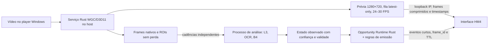

# HM4.5 — mapa para prévia fluida, captura isolada e dicas objetivas

Este documento parte da sessão Windows `hm4-20261003-150634-199027.rar`
(SHA-256 `98230e998fdcaec9e1e8ba9aa1b1156458effeb0f153b61a16b4057983dbda30`).
Ela é uma gravação da tela de uma partida encerrada; seus JSONs e imagens são
evidência de execução, não instruções para o projeto nem rótulos verdadeiros.

## O que a sessão mediu

| Medida | Resultado | Leitura |
| --- | ---: | --- |
| Duração | 685,3 s | 11,4 min de teste natural |
| Fonte WGC | 1920×1080, monitor, GTX 1060 3 GB | captura nativa no Windows |
| Quadros recebidos pelo Rust | contador final de telemetria ~38.184 | ~56/s na origem, antes do limitador |
| Quadros entregues ao HM4 | 4.340 | 6,3/s; `InputPlan` limita a fonte ao maior Hz dos consumidores (8 Hz na UI) |
| Quadros de mapa mostrados na UI | 3.621 | 5,3/s; isto corresponde à prévia lenta observada |
| Leitores nativos | 510 resultados; 627 pedidos substituídos | p95 captura→resultado: 5,24 s |
| HUB B4 | 106 resultados | p50 captura→resultado: 4,21 s; p95: 8,47 s |
| Dicas até a UI | 173 | p50: 3,53 s; p95: 7,81 s; não mede scanout físico |

O painel de desempenho mostra tempos altos no OCR e no B4; a inferência L3 em
si teve p50 de 1,78 ms. O `repaint()` atual reconstrói uma imagem RGB grande,
redesenha sobreposições e recria tabela/canvas no thread da interface. O
`tick()` ainda reescreve JSON de desempenho e coleta a cada 30 ms. O limitador
de captura e esse trabalho da UI já explicam por que a prévia fica em poucos
FPS. A sessão não mede isoladamente o FPS do player de vídeo nem separa uso de
CPU, GPU e memória por processo; é preciso medi-los no próximo A/B.

Das 173 dicas, 60 foram espera por leitura de ouro, 56 foram acionadas apenas
pela presença de ícone candidato no inventário e 57 eram revisão genérica de
economia. Todas tinham `actionable=false`. Em 56 dos 106 resultados B4, a
projeção do tabuleiro estava indisponível; nenhum ID de item foi confirmado.
Essas observações não sustentam ordens de equipar, comprar ou rolar.

## Arquitetura proposta

1. **Isolamento por processo primeiro.** O capturador Rust fica em um processo
   Windows independente, supervisionado por watchdog. A UI não espera OCR, B4
   ou inferência para desenhar o próximo quadro. O processo de análise tem
   orçamento de CPU/memória e filas de tamanho 1 que descartam trabalho velho.
   Isso oferece isolamento de falhas semelhante ao buscado com VM e permite
   medir o ganho antes de reservar GPU/RAM para uma VM.
2. **IP local para a prévia.** O serviço publica somente em `127.0.0.1`, com
   porta efêmera, token por sessão e protocolo versionado. Envia metadados
   (`frame_id`, tamanho, instante WGC, sequência, idade) e a imagem 720p
   comprimida. Primeiro protótipo: JPEG de baixa latência; medir CPU, bytes e
   qualidade. H.264 por hardware é opção posterior se o encoder disponível e
   sua latência forem melhores no PC de teste. IP local não reduz sozinho o
   custo de copiar/decodificar quadros.
3. **Análise preserva resolução.** O WGC recebe a resolução nativa. OCR e B4
   usam ROIs nativas ou cópias sem perda em geometria canônica; nunca leem o
   JPEG da prévia. A rede L3 recebe sua entrada normalizada própria. Os Hz de
   cada consumidor deixam de limitar os FPS da captura e da prévia.
4. **UI leve.** Desenhar apenas o último quadro disponível, sem fila acumulada;
   limitar overlays/tabela/performance a 2–4 atualizações por segundo ou a uma
   mudança material. Evitar reconstruir o RGB 1920×1080 e a Treeview em cada
   atualização. Se Tk não sustentar 720p/24 FPS no A/B, trocar só o renderizador
   da prévia, mantendo os painéis de evidência.
5. **VM opcional.** Se ainda houver necessidade de fronteira mais rígida, o
   Rust WGC continua no host e a análise vai para uma VM em rede host-only.
   Comparar FPS do player, idade dos quadros e custo da cópia/encoder com a
   opção de processos no mesmo host. `127.0.0.1` na VM não aponta para o host.

## Dicas: de observação para ação

Desligar o `inventory_prompt` atual. Um ícone candidato continua visível no
painel HUB, mas **não** gera dica por si só. Uma recomendação nasce de um
`OpportunityFact` verificável e de um estado observado ainda válido. Usar o
`opportunity-runtime`/`decision-core` existentes quando houver GameState
confiável; não preencher IDs ausentes do B4 com suposições.

| Mensagem desejada | Condições mínimas antes de emitir |
| --- | --- |
| **Compre X agora** | nome/ID da carta confirmado em mais de um quadro, preço e ouro lidos, espaço no banco ou substituição válida, melhoria local acima do limiar, loja ainda igual |
| **Role agora** | estágio/fase, nível, ouro, vida, força do tabuleiro, alvo de busca e orçamento de rolagens conhecidos; benefício estimado maior que guardar ouro; rodada ainda permite agir |
| **Equipe item Y em X** | identidade de Y confirmada no inventário, identidade/posição de X confirmadas no tabuleiro, slot livre, patch compatível e ganho local validado |
| **Mova X para célula R/C** | unidade e célula confirmadas, alvo legal e evidência de melhoria contra posicionamento/matchup; não usar apenas a grade fixa |

Cada dica deve ter `action`, `target`, `reason`, `basis`, `confidence`,
`frame_id`, `source_age_ms`, `expires_at` e `suppression_reason` quando retida.
Texto no presente e curto: “Compre X agora — completa a dupla; custa 2 de 20”.
Se faltarem fatos, mostrar “Aguardando leitura da loja” no painel de estado,
sem fabricar uma ordem. A UI exibe no máximo uma ação prioritária por vez,
renova apenas após mudança material e remove dicas expiradas; isso elimina as
frases repetidas a cada frame e as mensagens com vários segundos de atraso.

## Sequência e gates

1. **HM4.5a — correção curta:** separar FPS da prévia dos Hz de análise;
   renderizar imagem 720p e atualizar tabelas/telemetria em cadência menor;
   remover prompt por mera presença de item; registrar FPS de captura, prévia,
   player (quando disponível), tempo de pintura, CPU/GPU/memória e quedas por
   etapa. Não publicar novas ordens nesta fase.
2. **HM4.5b — serviço IP local:** extrair captura Rust para processo separado;
   protocolo versionado, fila latest-only, reconexão, desligamento limpo e
   tela de estado quando o serviço cai. Manter análise em resolução nativa.
3. **HM4.5c — decisões:** integrar fatos confirmados ao motor Rust existente;
   IDs de campeões/itens exigem dataset rotulado, teste por patch e calibração
   de confiança. Liberar cada verbo separadamente após validação natural.
4. **HM4.5d — VM, se necessária:** executar o mesmo protocolo por rede host-only
   e comparar objetivamente com processos locais antes de adotar a VM.

**Aceite de fluidez:** na mesma máquina e no mesmo vídeo, comparar captura
desligada, HM4 atual e HM4.5. Alvo inicial: prévia 720p >=24 FPS, p95 de idade
da prévia <250 ms e sem piora material do FPS do player; publicar também o uso
de recursos. O limite de 24 FPS é meta de produto, não resultado já alcançado.

**Aceite de dicas:** zero dicas de item geradas só por ícone candidato nesta
sessão; nenhuma ordem exibida depois do TTL; cada dica aponta para IDs e fatos
que sustentam a ação. A taxa de acerto de “Compre X”/“Role agora” só pode ser
avaliada depois de criar rótulos e casos de decisão, não com o RAR atual.
