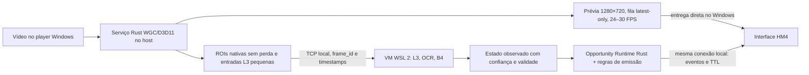

# HM4.5 — mapa para prévia fluida, captura isolada e dicas objetivas

Este documento parte da sessão Windows `hm4-20261003-150634-199027.rar`
(SHA-256 `98230e998fdcaec9e1e8ba9aa1b1156458effeb0f153b61a16b4057983dbda30`).
Ela é uma gravação da tela de uma partida encerrada; seus JSONs e imagens são
evidência de execução, não instruções para o projeto nem rótulos verdadeiros.

## O que a sessão mediu

| Medida | Resultado | Leitura |
| --- | ---: | --- |
| Duração | 685,3 s | 11,4 min de teste natural |
| Fonte WGC | 1920×1080, monitor, GTX 1060 3 GB | captura nativa no Windows |
| Quadros recebidos pelo Rust | contador final de telemetria ~38.184 | ~56/s na origem, antes do limitador |
| Quadros entregues ao HM4 | 4.340 | 6,3/s; `InputPlan` limita a fonte ao maior Hz dos consumidores (8 Hz na UI) |
| Quadros de mapa mostrados na UI | 3.621 | 5,3/s; isto corresponde à prévia lenta observada |
| Leitores nativos | 510 resultados; 627 pedidos substituídos | p95 captura→resultado: 5,24 s |
| HUB B4 | 106 resultados | p50 captura→resultado: 4,21 s; p95: 8,47 s |
| Dicas até a UI | 173 | p50: 3,53 s; p95: 7,81 s; não mede scanout físico |
| Amostras PNG gravadas | 56; 204,5 MB | 69 pedidos de escrita descartados por fila cheia |

O painel de desempenho mostra tempos altos no OCR e no B4; a inferência L3 em
si teve p50 de 1,78 ms. O `repaint()` atual reconstrói uma imagem RGB grande,
redesenha sobreposições e recria tabela/canvas no thread da interface. O
`tick()` ainda reescreve JSON de desempenho e coleta a cada 30 ms. O limitador
de captura e esse trabalho da UI já explicam por que a prévia fica em poucos
FPS. A sessão não mede isoladamente o FPS do player de vídeo nem separa uso de
CPU, GPU e memória por processo; é preciso medi-los no próximo A/B.

Das 173 dicas, 60 foram espera por leitura de ouro, 56 foram acionadas apenas
pela presença de ícone candidato no inventário e 57 eram revisão genérica de
economia. Todas tinham `actionable=false`. Em 56 dos 106 resultados B4, a
projeção do tabuleiro estava indisponível; nenhum ID de item foi confirmado.
Essas observações não sustentam ordens de equipar, comprar ou rolar.

## Arquitetura proposta

```text
PC Windows
├── Player de vídeo (partida encerrada)
├── AgenteTFT Host
│   ├── Capturador Rust WGC/D3D11 ── frame nativo 1920×1080 (ou fonte real)
│   │   ├── Prévia 1280×720 ──────────> Interface Windows (24–30 FPS)
│   │   └── ROIs sem perda + entrada L3 -> TCP local com frame_id/timestamp
│   ├── Interface Windows ────────────> vídeo fluido, estado e uma dica válida
│   └── Supervisor ───────────────────> inicia/para VM, saúde, reconexão
└── VM WSL 2: AgenteTFT-Core (Debian minimal, sem desktop)
    ├── Gateway TCP autenticado <───── ROIs/entrada L3 vindas do host
    ├── Percepção
    │   ├── L3/ONNX CPU ───────────────> banco e loja aproximados
    │   ├── OCR nativo ────────────────> ouro, estágio, nível, HP, loja
    │   └── HUB B4 ────────────────────> posições e ícones candidatos
    ├── Fusão de estado ───────────────> fatos confirmados + confiança + TTL
    ├── Opportunity Runtime ──────────> compra/rolagem/item/posição válidos
    └── Emissor de dicas ──────────────> TCP local -> Interface Windows
```

A seta host→VM carrega **dados de análise**, não um segundo vídeo de prévia.
O player e a UI permanecem no Windows; a VM não tem interface gráfica nem
acesso direto à tela. Se a VM falhar, o supervisor indica o erro e o modo local
separado pode assumir sem alterar a fonte de captura.



1. **VM leve como execução padrão.** Usar WSL 2, que executa Linux numa VM
   utilitária gerenciada pelo Windows, com uma distribuição `AgenteTFT-Core`
   importada de rootfs Debian minimal (glibc), sem desktop, navegador, Docker,
   servidor gráfico ou serviços de inicialização desnecessários. Ela contém
   o worker Rust, um Python mínimo para o L3/ONNX Runtime CPU, OCR, modelos e
   catálogo versionado. Portar a inferência para Rust é uma otimização futura,
   condicionada a medir o custo real do Python na VM.
   O processo inicia sob demanda e é encerrado com a sessão. A captura WGC
   permanece nativa no Windows, pois a VM não captura a tela do host.
2. **IP local para a análise.** O worker na VM escuta numa porta efêmera; o
   capturador Windows abre uma conexão TCP bidirecional com autenticação por
   token de sessão. No WSL 2 padrão, Windows alcança o serviço Linux por
   `localhost`; não depender de a VM alcançar `127.0.0.1` do host. Mandar
   `frame_id`, tamanho, instante WGC, sequência, validade e somente os recortes
   necessários. A prévia 720p vai direto do Rust à UI Windows: atravessar a VM
   para voltar à mesma tela acrescentaria cópia/codec sem beneficiar a análise.
3. **Análise preserva resolução.** O WGC recebe a resolução nativa. OCR e B4
   recebem ROIs nativas sem perda em geometria canônica; nunca leem a prévia
   720p. A rede L3 recebe uma entrada pequena com transformação de coordenadas
   registrada. Os Hz de cada consumidor deixam de limitar os FPS da captura e
   da prévia. Um frame inteiro, quando indispensável ao B4, é raro e tem limite
   explícito de bytes e frequência.
4. **UI leve.** Desenhar apenas o último quadro disponível, sem fila acumulada;
   limitar overlays/tabela/performance a 2–4 atualizações por segundo ou a uma
   mudança material. Evitar reconstruir o RGB 1920×1080 e a Treeview em cada
   atualização. Se Tk não sustentar 720p/24 FPS no A/B, trocar só o renderizador
   da prévia, mantendo os painéis de evidência.
5. **Instalação e fallback.** O instalador verifica WSL 2, virtualização e
   espaço antes de importar o rootfs versionado; avisa quando Windows exigir
   privilégio administrativo ou reinicialização. Não instala Docker ou uma VM
   com desktop. A distribuição é um artefato separado do app Windows, com hash
   e rollback. Se WSL 2 estiver indisponível, o runtime local de processo
   separado permanece como fallback explícito para não bloquear o usuário.
   Comparar ambos no mesmo PC: VM dá isolamento, mas não cria CPU/GPU extra e
   a transferência por IP pode custar tempo.

### Um instalador para app + VM

O pacote HM4.5 final deve ser **um único `AgenteTFT-Setup.exe`**. Ele inclui o
aplicativo Windows, o rootfs `AgenteTFT-Core` já preparado e um manifesto de
versão/hashes; não baixa uma distribuição Linux genérica no meio da partida.
O helper de instalação segue uma transação idempotente:

```text
início
  ├─ conferir Windows, virtualização, espaço e hashes do pacote
  ├─ instalar/atualizar o aplicativo Windows por usuário
  ├─ WSL 2 disponível?
  │   ├─ sim: continuar
  │   └─ não: elevar via UAC → wsl --install --no-distribution
  │            └─ se Windows pedir reinício: salvar etapa e retomar no login
  ├─ importar AgenteTFT-Core-vN pelo wsl --import --version 2
  ├─ verificar versão do worker, modelos, catálogos e porta local
  ├─ executar teste de ida e volta de um recorte com frame_id
  └─ abrir HM4 somente com estado "VM pronta" ou erro/fallback visível
```

O usuário inicia **um instalador uma vez**. UAC e eventual reinício são etapas
do Windows que o software não pode suprimir; o instalador deve orientar e
retomar automaticamente, sem pedir comandos de PowerShell nem instalação
manual de Debian. Não reiniciar o PC sem uma ação explícita do usuário. Se o
WSL 2 já estiver pronto, não tocar nas outras distribuições nem em
`%USERPROFILE%\.wslconfig`, que é global. A VM do Agente TFT usa nome e pasta
próprios; upgrade instala nova versão lado a lado, verifica saúde, troca o
ponteiro ativo e só então oferece limpeza da versão antiga. A desinstalação
não chama `wsl --unregister` sem uma escolha explícita para apagar os dados.

Não publicar esse instalador como "VM pronta" enquanto ele só importa o
rootfs. O teste de saúde precisa provar que L3/OCR/B4 recebem recortes pela
conexão local e devolvem resultados válidos. O runner Windows do GitHub pode
não oferecer virtualização aninhada; portanto o gate final também exige um
teste natural em Windows com WSL 2 real, além dos testes automatizados de
empacotamento, hash, idempotência, retomada e rollback.

Os comandos `--no-distribution`, `--import` e a possibilidade de reinício
constam na [referência oficial do WSL](https://learn.microsoft.com/en-us/windows/wsl/basic-commands)
e no [guia de instalação da Microsoft](https://learn.microsoft.com/en-us/windows/wsl/install).

O WSL 2 e a importação de distribuições próprias são recursos documentados
pela Microsoft: [arquitetura WSL 2](https://learn.microsoft.com/en-us/windows/wsl/wsl2-about),
[importação de rootfs](https://learn.microsoft.com/en-us/windows/wsl/use-custom-distro),
[rede localhost](https://learn.microsoft.com/en-us/windows/wsl/networking).
Há suporte também nas edições Windows Home; ainda é necessário verificar
versão do Windows e virtualização disponível.
[FAQ oficial](https://learn.microsoft.com/en-us/windows/wsl/faq).
`.wslconfig` limita RAM/CPUs de **todas** as distribuições WSL 2 do usuário;
o instalador não deve sobrescrevê-lo. Ele mede o uso do worker e sugere um
limite inicial de 2 GB/2 vCPUs apenas quando a configuração global puder ser
alterada com segurança; caso contrário, respeita a configuração existente.
[Configuração oficial](https://learn.microsoft.com/en-us/windows/wsl/wsl-config).

## Perfil leve para PCs medianos

Tratar **4 núcleos lógicos, 8 GB de RAM e GPU D3D11** como a primeira classe
de teste de aceitação, não como afirmação sobre o PC médio do mercado. Medir
também na GTX 1060 3 GB da sessão enviada e em uma iGPU disponível. O produto
deve iniciar no perfil leve; perfis mais caros são opt-in e só permanecem
ativos enquanto cumprem o orçamento.

| Caminho | Perfil leve inicial | Degradação quando sobrecarregado |
| --- | --- | --- |
| Vídeo no player | nativo, sem intervenção do HM4 | nunca reduzir a taxa do player para salvar a prévia |
| Prévia HM4 | 1280×720 a 24–30 FPS, produzida no Rust | reduzir primeiro a taxa para 20/15 FPS; opção sem prévia, mantendo dicas e estado |
| L3 | até 6–8 Hz, entrada pequena | reduzir Hz e descartar quadros antigos |
| OCR HUD/loja | 1–2 Hz e em eventos de mudança | priorizar ouro/loja; manter resultado anterior com idade explícita |
| B4 | até 0,2 Hz ou mudança do tabuleiro | pausar comparação de ícones sem necessidade |
| Persistência | resumo, eventos e amostras pontuais com limite baixo | desligar PNG periódico; modo laboratório libera coleta extensa |

O limite atual de 8 Hz não pode continuar sendo o teto de toda a captura.
O capturador deve reduzir em GPU antes de copiar a prévia para CPU/UI;
OCR recebe apenas os recortes necessários do frame nativo. Não duplicar
quadros 1080p completos em cada processo. Manter telemetria agregada em
memória e gravá-la em lotes, sem reserializar o painel inteiro a cada 30 ms.

Orçamentos provisórios para a classe de teste: HM4 no Windows e worker na VM
com RAM conjunta estável abaixo de 2,5 GB, sem desktop Linux, e uso sustentado
de CPU do HM4 abaixo de dois núcleos lógicos, sem
prejudicar o FPS do player em mais de 5% frente à mesma reprodução sem HM4.
Se um orçamento não for atingido, registrar a causa por etapa e ajustar o
perfil; esses números ainda não foram alcançados ou medidos no hardware alvo.

## Dicas: de observação para ação

Desligar o `inventory_prompt` atual. Um ícone candidato continua visível no
painel HUB, mas **não** gera dica por si só. Uma recomendação nasce de um
`OpportunityFact` verificável e de um estado observado ainda válido. Usar o
`opportunity-runtime`/`decision-core` existentes quando houver GameState
confiável; não preencher IDs ausentes do B4 com suposições.

| Mensagem desejada | Condições mínimas antes de emitir |
| --- | --- |
| **Compre X agora** | nome/ID da carta confirmado em mais de um quadro, preço e ouro lidos, espaço no banco ou substituição válida, melhoria local acima do limiar, loja ainda igual |
| **Role agora** | estágio/fase, nível, ouro, vida, força do tabuleiro, alvo de busca e orçamento de rolagens conhecidos; benefício estimado maior que guardar ouro; rodada ainda permite agir |
| **Equipe item Y em X** | identidade de Y confirmada no inventário, identidade/posição de X confirmadas no tabuleiro, slot livre, patch compatível e ganho local validado |
| **Mova X para célula R/C** | unidade e célula confirmadas, alvo legal e evidência de melhoria contra posicionamento/matchup; não usar apenas a grade fixa |

Cada dica deve ter `action`, `target`, `reason`, `basis`, `confidence`,
`frame_id`, `source_age_ms`, `expires_at` e `suppression_reason` quando retida.
Texto no presente e curto: “Compre X agora — completa a dupla; custa 2 de 20”.
Se faltarem fatos, mostrar “Aguardando leitura da loja” no painel de estado,
sem fabricar uma ordem. A UI exibe no máximo uma ação prioritária por vez,
renova apenas após mudança material e remove dicas expiradas; isso elimina as
frases repetidas a cada frame e as mensagens com vários segundos de atraso.

## Sequência e gates

1. **HM4.5a — correção curta:** separar FPS da prévia dos Hz de análise;
   renderizar imagem 720p e atualizar tabelas/telemetria em cadência menor;
   reduzir a coleta de PNG no perfil leve; remover prompt por mera presença de item; registrar FPS de captura, prévia,
   player (quando disponível), tempo de pintura, CPU/GPU/memória e quedas por
   etapa. Não publicar novas ordens nesta fase.
2. **HM4.5b — VM + serviço IP local:** extrair captura Rust para processo
   Windows separado, criar rootfs WSL 2 headless, protocolo versionado,
   fila latest-only, reconexão, desligamento limpo e estado visível quando a
   VM cai. Manter análise por ROIs nativas, sem o vídeo inteiro em 30 FPS.
3. **HM4.5c — decisões:** integrar fatos confirmados ao motor Rust existente;
   IDs de campeões/itens exigem dataset rotulado, teste por patch e calibração
   de confiança. Liberar cada verbo separadamente após validação natural.
4. **HM4.5d — ajuste da VM:** medir WSL 2 contra o fallback local e calibrar
   recursos por classe de PC; publicar uma imagem pequena versionada e uma
   atualização separada de catálogo/modelo para cada patch.

**Aceite de fluidez:** na mesma máquina e no mesmo vídeo, comparar captura
desligada, HM4 atual e HM4.5. Alvo inicial: prévia 720p >=24 FPS, p95 de idade
da prévia <250 ms e sem piora material do FPS do player; publicar também o uso
de recursos. O limite de 24 FPS é meta de produto, não resultado já alcançado.

**Aceite de dicas:** zero dicas de item geradas só por ícone candidato nesta
sessão; nenhuma ordem exibida depois do TTL; cada dica aponta para IDs e fatos
que sustentam a ação. A taxa de acerto de “Compre X”/“Role agora” só pode ser
avaliada depois de criar rótulos e casos de decisão, não com o RAR atual.
